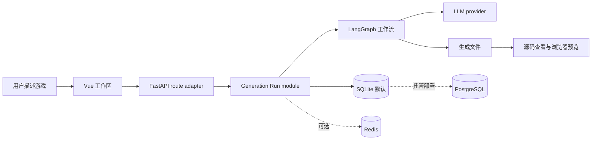

<p align="right">
  <strong>简体中文</strong> · <a href="./README_EN.md">English</a>
</p>

<div align="center">
  
  <h1>DreamCoder</h1>
  <p><strong>用自然语言生成、继续修改并预览可运行的 Web 小游戏。</strong></p>
  <p>一个面向 AI 应用开发者与学习者的开源、自托管参考项目。</p>

  [](./LICENSE)
  [](https://www.python.org/)
  [](https://vuejs.org/)
</div>

## DreamCoder 是什么？

DreamCoder 展示了一个完整 LLM 应用如何把自然语言需求转换为可运行的 HTML/CSS/JavaScript 小游戏，并维护项目、聊天、生成文件和后续修改。

它适合：

- 学习 FastAPI、Vue、LangGraph 和 LLM 应用工程的开发者；
- 希望研究“需求 → 工作流 → 代码 → 预览”完整链路的学生和技术作者；
- 需要快速验证浏览器小游戏想法的独立开发者和 Hackathon 团队。

它目前不是成熟的通用 AI IDE，也不是面向非技术用户的托管 SaaS。

## 为什么值得研究？

- **生成结果可试玩**：产物不只是文本，而是可以在浏览器中查看源码和预览的小游戏。
- **支持继续修改**：已有文件会进入下一次生成，不会把“继续开发”退化成重新生成。
- **生命周期可测试**：项目状态、数据库事务、步骤日志和失败收尾集中在 generation run module。
- **本地启动轻量**：默认使用 SQLite 和进程内验证码存储，不要求 Docker、PostgreSQL 或 Redis。
- **基础设施可升级**：托管部署时可切换 PostgreSQL、Redis、ChromaDB 和外部验证码渠道。

## 核心流程



## 十分钟 Quickstart

### 环境要求

- Python 3.11+
- Node.js 20.19+ 或 22.12+
- OpenAI、DeepSeek 或 Qwen 的一个 API Key

Docker、PostgreSQL、Redis 和 ChromaDB 均不是本地启动的必需项。

### 1. 克隆并配置模型

```bash
git clone https://github.com/44-99/DreamCoder.git
cd DreamCoder
```

macOS / Linux：

```bash
cp backend/.env.example backend/.env
```

Windows PowerShell：

```powershell
Copy-Item backend/.env.example backend/.env
```

编辑 `backend/.env`。默认示例使用 DeepSeek：

```env
LLM_PROVIDER=deepseek
DEEPSEEK_API_KEY=your-key
```

### 2. 启动后端

macOS / Linux：

```bash
cd backend
python -m venv .venv
source .venv/bin/activate
pip install -r requirements.txt
uvicorn main:app --reload
```

Windows PowerShell：

```powershell
cd backend
python -m venv .venv
.\.venv\Scripts\Activate.ps1
pip install -r requirements.txt
uvicorn main:app --reload
```

后端启动后可访问：

- 健康检查：<http://localhost:8000/>
- OpenAPI 文档：<http://localhost:8000/docs>

### 3. 启动前端

打开第二个终端：

```bash
cd frontend
npm install
npm run dev
```

访问 <http://localhost:5173>。

开发模式发送验证码时，后端会生成一次性开发验证码，前端会自动填入。该模式只适合本机开发，公开部署必须配置外部邮件或短信渠道。

### 4. 生成第一个游戏

注册并登录后，可以输入：

> 生成一个复古像素风贪吃蛇游戏，支持方向键控制、计分、暂停和重新开始。

生成完成后，再输入：

> 保留原有玩法，增加最高分记录和速度逐渐提升的机制。

这次继续生成会把项目已有文件作为输入。

## 模型配置

| Provider | `LLM_PROVIDER` | 必需变量 | 默认模型 |
|---|---|---|---|
| DeepSeek | `deepseek` | `DEEPSEEK_API_KEY` | `deepseek-v4-flash` |
| OpenAI | `openai` | `OPENAI_API_KEY` | `gpt-5.6-terra` |
| Qwen | `qwen` | `QWEN_API_KEY` | `qwen3.7-plus` |

默认 ID 于 2026-07-23 根据各 provider 官方模型目录更新；模型名称会演进，升级前请复核 [DeepSeek](https://api-docs.deepseek.com/quick_start/pricing)、[OpenAI](https://developers.openai.com/api/docs/guides/latest-model) 与 [Qwen](https://help.aliyun.com/zh/model-studio/getting-started/models) 文档。所有默认值都可以通过环境变量覆盖。

具体变量和 Base URL 示例见 [`backend/.env.example`](./backend/.env.example)。应用启动时不会连接模型；第一次生成时才检查对应 Key。

## 本地模式与托管模式

| 能力 | 本地默认 | 托管部署 |
|---|---|---|
| 数据库 | SQLite | PostgreSQL |
| 验证码存储 | 进程内 TTL store | Redis |
| 验证码渠道 | 控制台开发码 | SMTP / 短信 |
| 模板检索 | 内存关键词 | 可选 ChromaDB |
| 启动方式 | Python + Node | 可选 Docker Compose |

安装托管部署和实验 adapters：

```bash
pip install -r backend/requirements-optional.txt
```

### 可选 Docker Compose

Compose 会启动 PostgreSQL、Redis、后端和开发前端：

```bash
cp backend/.env.example .env
# 编辑根目录 .env，至少设置模型 Key 和 SECRET_KEY
docker compose --profile dev up --build
```

公开部署前必须设置：

```env
ENVIRONMENT=production
AUTH_DELIVERY_MODE=external
SECRET_KEY=a-long-random-secret
```

并配置 SMTP 或阿里云短信参数。Docker 是部署选项，不是本地开发前提。

## 测试与构建

后端：

```bash
cd backend
python -m unittest discover -s tests -v
```

前端：

```bash
cd frontend
npm run build
```

## 项目结构

```text
DreamCoder/
├── backend/
│   ├── core/                 # 配置、模型、模板和基础 adapters
│   ├── modules/              # deep 业务 modules
│   │   ├── generation_run.py
│   │   └── generated_artifact.py
│   ├── routers/              # FastAPI route adapters
│   ├── workflows/            # LangGraph 游戏生成工作流
│   ├── tests/                # 生命周期、认证和存储测试
│   ├── .env.example
│   ├── requirements.txt      # 本地核心依赖
│   └── requirements-optional.txt
├── frontend/                 # Vue 3 工作区、源码视图和预览
├── CONTEXT.md                # 项目领域词汇
├── Dockerfile
└── docker-compose.yml
```

## 当前限制

- 主要针对 HTML/CSS/JavaScript 浏览器小游戏；其他语言只有下载和运行提示。
- 代码验证目前是启发式检查，不等同于浏览器自动化测试或安全审计。
- 预览已使用 CSP 和最小 iframe sandbox，但尚未经过不可信多租户环境的完整安全审计。
- SSE endpoint 当前在工作流结束后返回步骤日志，不是真正的 token 或节点实时流。
- ChromaDB 和 MCP 仍属于可选实验能力，不是核心 Quickstart 的组成部分。
- 进程内验证码存储只适合单进程本地开发。

## Roadmap

- [x] 阻止生成产物路径穿越，并收紧 iframe sandbox 与联网权限
- [ ] 将预览迁移到独立 origin 或隔离容器
- [ ] 将模型 provider、结构化解析和重试集中到 deep module
- [ ] 增加真正的节点级实时进度
- [ ] 提供示例游戏 gallery 和演示 GIF
- [ ] 增加 CI、贡献指南、Discussions 和 good first issues
- [ ] 用评测集验证模板检索和代码质量，而不是使用未经验证的指标

## 贡献

欢迎提交 Issue 和 Pull Request。特别欢迎：

- 可复现的生成失败案例；
- 新的浏览器小游戏示例；
- provider adapter、测试和安全改进；
- Quickstart 在不同系统上的实测反馈。

## License

DreamCoder 使用 [MIT License](./LICENSE)。
