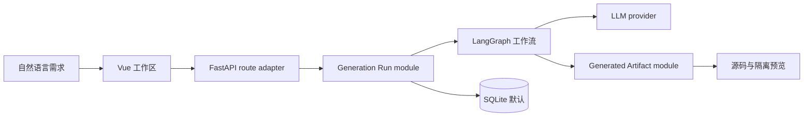

<p align="right">
  <strong>简体中文</strong> · <a href="./README_EN.md">English</a>
</p>

<div align="center">
  
  <h1>DreamCoder</h1>
  <p><strong>用自然语言生成、继续修改并预览可运行的 Web 小游戏。</strong></p>
  <p>面向 AI 应用开发者与学习者的开源、自托管参考项目。</p>

  [](https://github.com/44-99/DreamCoder/actions/workflows/ci.yml)
  [](./LICENSE)
  [](https://www.python.org/)
  [](https://vuejs.org/)
</div>


> 截图中的三个游戏是可离线运行的确定性示例，用于展示目标产物和视觉验收；它们不代表某个模型的固定生成质量。

## 它解决什么问题？

很多 LLM 教程停在“一问一答”。DreamCoder 展示一条更完整的工程链路：

**描述需求 → 工作流生成文件 → 安全校验 → 浏览器预览 → 基于现有文件继续修改**

它适合想研究 FastAPI、Vue 3、LangGraph、结构化生成和生成式 UI 的开发者、学生与技术作者。当前项目不是成熟的通用 AI IDE，也不是面向非技术用户的托管 SaaS。

## 核心能力

- **生成结果可试玩**：查看生成的 HTML/CSS/JavaScript 源码并直接预览。
- **支持连续修改**：后续需求会带上项目已有文件，不会退化成重新生成。
- **生命周期可测试**：项目状态、事务、步骤日志和失败收尾由 Generation Run module 统一管理。
- **默认本地优先**：SQLite 与进程内验证码即可启动；Docker、PostgreSQL、Redis 均非必需。
- **生成内容按不可信输入处理**：包含路径、文件数量、入口文件、CSP 与 iframe sandbox 约束。

## 十分钟启动

需要 Python 3.11+、Node.js 20.19+ 或 22.12+，以及一个 DeepSeek、OpenAI 或 Qwen API Key。

```bash
git clone https://github.com/44-99/DreamCoder.git
cd DreamCoder
cp backend/.env.example backend/.env  # PowerShell: Copy-Item backend/.env.example backend/.env
```

编辑 `backend/.env`，至少填写所选 provider 的 Key。默认示例使用 DeepSeek：

```env
LLM_PROVIDER=deepseek
DEEPSEEK_API_KEY=your-key
```

终端 1：

```bash
cd backend
python -m venv .venv
# macOS/Linux: source .venv/bin/activate
# Windows PowerShell: .\.venv\Scripts\Activate.ps1
pip install -r requirements.txt
uvicorn main:app --reload
```

终端 2：

```bash
cd frontend
npm install
npm run dev
```

打开 <http://localhost:5173>，注册并输入：

> 生成一个复古像素风贪吃蛇游戏，支持方向键控制、计分、暂停和重新开始。

开发模式会在本机生成并自动填入一次性验证码。完整的跨平台步骤、成功检查点和故障排查见[入门指南](./docs/getting-started.md)。

## 不用模型 Key 先试玩

```bash
python -m http.server 4173
```

访问 <http://localhost:4173/examples/>：

- [Neon Snake](./examples/neon-snake/index.html)
- [Prism Breakout](./examples/prism-breakout/index.html)
- [Orbit Dodge](./examples/orbit-dodge/index.html)

## 架构



本地启动只依赖 Python、Node.js、SQLite 和一个模型 provider。PostgreSQL、Redis、ChromaDB 与 Docker Compose 是托管或实验场景的可选 adapter，不是为了“堆技术栈”的前置要求。

## 文档

| 目标 | 中文 | English |
|---|---|---|
| 从零跑通 | [入门指南](./docs/getting-started.md) | [Getting started](./docs/getting-started.en.md) |
| 理解设计 | [架构说明](./docs/architecture.md) | [Architecture](./docs/architecture.en.md) |
| 托管部署 | [部署指南](./docs/deployment.md) | [Deployment](./docs/deployment.en.md) |
| 安全边界 | [安全说明](./docs/security.md) | [Security](./docs/security.en.md) |
| 参与开发 | [贡献指南](./CONTRIBUTING.md) | [Contributing](./CONTRIBUTING.md) |
| 后续计划 | [Roadmap](./ROADMAP.md) | [Roadmap](./ROADMAP.md) |

模型变量与可覆盖的默认 ID 见 [`backend/.env.example`](./backend/.env.example)。模型名称会演进，使用前请以 provider 官方目录为准。

## 当前边界

- 主要生成 HTML/CSS/JavaScript 浏览器小游戏。
- 代码验证仍是启发式检查，不等于浏览器自动化测试或安全审计。
- SSE 当前返回工作流步骤日志，不是 token 级实时流。
- 公开部署需要外部验证码渠道、强 `SECRET_KEY`、显式 `CORS_ALLOWED_ORIGINS`，以及更强的预览隔离。

## 贡献与许可

欢迎提交可复现的生成失败、示例游戏、provider 兼容性修复和安全改进。请先阅读[贡献指南](./CONTRIBUTING.md)。

DreamCoder 使用 [MIT License](./LICENSE)。
