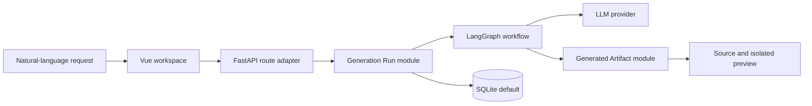

<p align="right">
  <a href="./README.md">简体中文</a> · <strong>English</strong>
</p>

<div align="center">
  
  <h1>DreamCoder</h1>
  <p><strong>Generate, iterate on, and preview playable web games with natural language.</strong></p>
  <p>An open-source, self-hosted reference project for AI application developers and learners.</p>

  [](https://github.com/44-99/DreamCoder/actions/workflows/ci.yml)
  [](./LICENSE)
  [](https://www.python.org/)
  [](https://vuejs.org/)
</div>


> These three offline games are curated, deterministic examples for product-shape and visual QA. They do not claim a fixed output quality for any model.

## What problem does it solve?

Many LLM tutorials stop at a single prompt and response. DreamCoder demonstrates a fuller engineering loop:

**Describe → generate files through a workflow → validate → preview → iterate on existing files**

It is for developers, students, and technical authors exploring FastAPI, Vue 3, LangGraph, structured generation, and generative UI. It is not yet a production-grade general AI IDE or a managed SaaS for non-technical creators.

## Core capabilities

- **Playable output** — inspect generated HTML/CSS/JavaScript and run it in the browser.
- **Real iteration** — follow-up requests receive the project's existing files.
- **Testable lifecycle** — the Generation Run module owns state, transactions, step logs, and failure completion.
- **Local-first defaults** — SQLite and an in-process verification store work without Docker, PostgreSQL, or Redis.
- **Untrusted-output handling** — path, file count, entry file, CSP, and iframe sandbox rules protect the preview boundary.

## Ten-minute quickstart

You need Python 3.11+, Node.js 20.19+ or 22.12+, and one DeepSeek, OpenAI, or Qwen API key.

```bash
git clone https://github.com/44-99/DreamCoder.git
cd DreamCoder
cp backend/.env.example backend/.env  # PowerShell: Copy-Item backend/.env.example backend/.env
```

Edit `backend/.env` and provide the key for your selected provider. The example defaults to DeepSeek:

```env
LLM_PROVIDER=deepseek
DEEPSEEK_API_KEY=your-key
```

Terminal 1:

```bash
cd backend
python -m venv .venv
# macOS/Linux: source .venv/bin/activate
# Windows PowerShell: .\.venv\Scripts\Activate.ps1
pip install -r requirements.txt
uvicorn main:app --reload
```

Terminal 2:

```bash
cd frontend
npm install
npm run dev
```

Open <http://localhost:5173>, register, and try:

> Build a retro pixel-art Snake game with arrow-key controls, scoring, pause, and restart.

Development mode creates and auto-fills a local one-time verification code. See [Getting started](./docs/getting-started.en.md) for cross-platform steps, checkpoints, and troubleshooting.

## Try the examples without a model key

```bash
python -m http.server 4173
```

Open <http://localhost:4173/examples/>:

- [Neon Snake](./examples/neon-snake/index.html)
- [Prism Breakout](./examples/prism-breakout/index.html)
- [Orbit Dodge](./examples/orbit-dodge/index.html)

## Architecture



Local development only requires Python, Node.js, SQLite, and one model provider. PostgreSQL, Redis, ChromaDB, and Docker Compose are optional adapters for hosted or experimental scenarios, not mandatory stack decoration.

## Documentation

| Goal | English | 中文 |
|---|---|---|
| Run it locally | [Getting started](./docs/getting-started.en.md) | [入门指南](./docs/getting-started.md) |
| Understand the design | [Architecture](./docs/architecture.en.md) | [架构说明](./docs/architecture.md) |
| Host the application | [Deployment](./docs/deployment.en.md) | [部署指南](./docs/deployment.md) |
| Review security boundaries | [Security](./docs/security.en.md) | [安全说明](./docs/security.md) |
| Contribute | [Contributing](./CONTRIBUTING.md) | [贡献指南](./CONTRIBUTING.md) |
| See what is next | [Roadmap](./ROADMAP.md) | [Roadmap](./ROADMAP.md) |

See [`backend/.env.example`](./backend/.env.example) for provider variables and overridable model IDs. Model catalogs evolve; verify an ID against the provider's official documentation before use.

## Current boundaries

- The primary target is HTML/CSS/JavaScript browser games.
- Code validation is heuristic, not browser automation or a security audit.
- SSE currently returns workflow step logs rather than token-level live streaming.
- Public hosting requires external verification delivery, a strong `SECRET_KEY`, explicit `CORS_ALLOWED_ORIGINS`, and stronger preview isolation.

## Contributing and license

Reproducible generation failures, example games, provider compatibility fixes, and security improvements are welcome. Read [CONTRIBUTING.md](./CONTRIBUTING.md) first.

DreamCoder is available under the [MIT License](./LICENSE).
