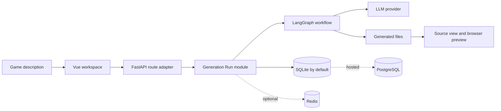

<div align="center">
  
  <h1>DreamCoder</h1>
  <p><strong>Generate, iterate on, and preview playable web games with natural language.</strong></p>
  <p>An open-source, self-hosted reference project for AI application developers and learners.</p>

  English · [简体中文](./README.md)

  [](./LICENSE)
  [](https://www.python.org/)
  [](https://vuejs.org/)
</div>

## What is DreamCoder?

DreamCoder demonstrates how a complete LLM application can turn natural-language requirements into playable HTML/CSS/JavaScript games while maintaining projects, conversations, generated files, and follow-up changes.

It is designed for:

- developers learning FastAPI, Vue, LangGraph, and LLM application engineering;
- students and technical authors studying the full requirements-to-preview workflow;
- indie developers and hackathon teams prototyping small browser games.

DreamCoder is not yet a production-grade general AI IDE or a managed SaaS for non-technical creators.

## Why explore it?

- **Playable output** — inspect the source and run the generated game in the browser.
- **Real continuation** — existing files are passed into follow-up generations.
- **Testable lifecycle** — project state, transactions, logs, and failure completion live in one generation run module.
- **Lightweight local setup** — SQLite and an in-process verification store are the defaults.
- **Upgradeable infrastructure** — hosted deployments can opt into PostgreSQL, Redis, ChromaDB, and external verification delivery.

## Architecture



## Ten-minute quickstart

### Prerequisites

- Python 3.11+
- Node.js 20.19+ or 22.12+
- one OpenAI, DeepSeek, or Qwen API key

Docker, PostgreSQL, Redis, and ChromaDB are not required for local development.

### 1. Clone and configure a model

```bash
git clone https://github.com/44-99/DreamCoder.git
cd DreamCoder
```

macOS / Linux:

```bash
cp backend/.env.example backend/.env
```

Windows PowerShell:

```powershell
Copy-Item backend/.env.example backend/.env
```

Edit `backend/.env`. The example defaults to DeepSeek:

```env
LLM_PROVIDER=deepseek
DEEPSEEK_API_KEY=your-key
```

### 2. Start the backend

macOS / Linux:

```bash
cd backend
python -m venv .venv
source .venv/bin/activate
pip install -r requirements.txt
uvicorn main:app --reload
```

Windows PowerShell:

```powershell
cd backend
python -m venv .venv
.\.venv\Scripts\Activate.ps1
pip install -r requirements.txt
uvicorn main:app --reload
```

The backend exposes:

- health check: <http://localhost:8000/>
- OpenAPI docs: <http://localhost:8000/docs>

### 3. Start the frontend

Open a second terminal:

```bash
cd frontend
npm install
npm run dev
```

Open <http://localhost:5173>.

In development, requesting a verification code creates a one-time development code and automatically fills it in the web form. Public deployments must configure an external email or SMS channel.

### 4. Generate and iterate on a game

After registering and signing in, try:

> Build a retro pixel-art Snake game with arrow-key controls, scoring, pause, and restart.

Then continue with:

> Preserve the existing gameplay and add a high-score record plus gradually increasing speed.

The second request receives the project's existing files.

## Model configuration

| Provider | `LLM_PROVIDER` | Required variable | Default model |
|---|---|---|---|
| DeepSeek | `deepseek` | `DEEPSEEK_API_KEY` | `deepseek-chat` |
| OpenAI | `openai` | `OPENAI_API_KEY` | `gpt-4o` |
| Qwen | `qwen` | `QWEN_API_KEY` | `qwen-plus` |

See [`backend/.env.example`](./backend/.env.example) for all variables and base URLs. DreamCoder initializes the selected provider on the first generation request, not during application startup.

## Local and hosted profiles

| Capability | Local default | Hosted deployment |
|---|---|---|
| Database | SQLite | PostgreSQL |
| Verification storage | In-process TTL store | Redis |
| Verification delivery | Development console code | SMTP / SMS |
| Template retrieval | In-memory keywords | Optional ChromaDB |
| Startup | Python + Node | Optional Docker Compose |

Install hosted and experimental adapters with:

```bash
pip install -r backend/requirements-optional.txt
```

### Optional Docker Compose

Compose starts PostgreSQL, Redis, the backend, and the development frontend:

```bash
cp backend/.env.example .env
# Edit the root .env and set at least a model key and SECRET_KEY.
docker compose --profile dev up --build
```

Before a public deployment, set:

```env
ENVIRONMENT=production
AUTH_DELIVERY_MODE=external
SECRET_KEY=a-long-random-secret
```

Then configure SMTP or Alibaba Cloud SMS. Docker is a deployment option, not a prerequisite for local development.

## Tests and builds

Backend:

```bash
cd backend
python -m unittest discover -s tests -v
```

Frontend:

```bash
cd frontend
npm run build
```

## Repository layout

```text
DreamCoder/
├── backend/
│   ├── core/                 # Configuration, models, templates, adapters
│   ├── modules/              # Deep business modules
│   │   ├── generation_run.py
│   │   └── generated_artifact.py
│   ├── routers/              # FastAPI route adapters
│   ├── workflows/            # LangGraph game-generation workflow
│   ├── tests/                # Lifecycle, authentication, and store tests
│   ├── .env.example
│   ├── requirements.txt      # Core local dependencies
│   └── requirements-optional.txt
├── frontend/                 # Vue workspace, source view, and preview
├── CONTEXT.md                # Domain vocabulary
├── Dockerfile
└── docker-compose.yml
```

## Current limitations

- The primary target is HTML/CSS/JavaScript browser games. Other languages only receive download and execution guidance.
- Code validation is heuristic; it is not browser automation or a security audit.
- Preview now uses a CSP and a minimal iframe sandbox, but it has not received a complete untrusted multi-tenant security audit.
- The SSE endpoint currently emits step logs after the workflow finishes; it is not token- or node-level live streaming.
- ChromaDB and MCP remain optional experiments rather than part of the core quickstart.
- The in-process verification store is suitable only for single-process local development.

## Roadmap

- [x] Block generated-artifact path traversal and reduce iframe/network privileges
- [ ] Move preview execution to a separate origin or isolated container
- [ ] Centralize provider differences, structured parsing, and retry behavior
- [ ] Add real node-level progress streaming
- [ ] Publish an example-game gallery and demo GIF
- [ ] Add CI, contribution guidelines, Discussions, and good first issues
- [ ] Evaluate retrieval and generated-code quality with reproducible datasets

## Contributing

Issues and pull requests are welcome. Useful contributions include reproducible generation failures, browser-game examples, provider adapters, tests, security improvements, and quickstart reports from different operating systems.

## License

DreamCoder is licensed under the [Apache License 2.0](./LICENSE).
