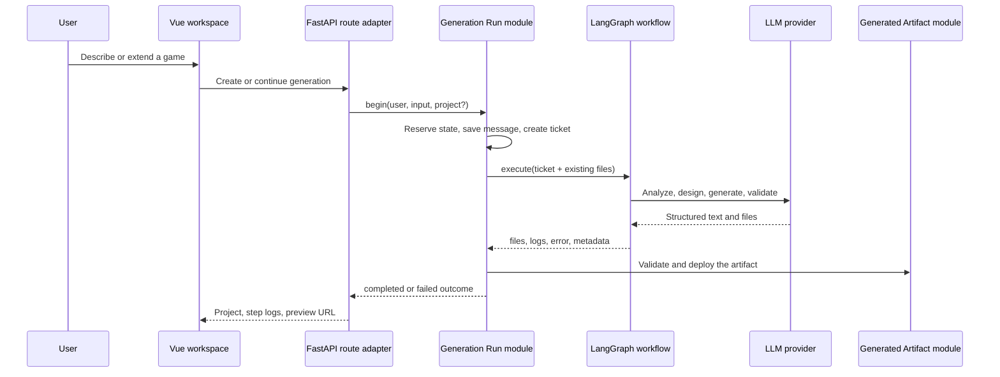

# DreamCoder architecture

## Design goals

DreamCoder is first a complete AI application reference that developers can understand and modify. Technology choices serve three user journeys:

1. create a playable browser game from natural language;
2. iterate on existing files instead of regenerating from scratch;
3. run locally with minimal dependencies and replace infrastructure adapters only when hosting requires it.

## Core flow

## Two deep modules

### Generation Run module

File: `backend/modules/generation_run.py`

Its interface exposes only the concepts needed to begin and execute one run while hiding:

- state transitions for new and continued projects;
- the existing-file snapshot;
- database transactions and failure rollback;
- workflow thread identity;
- step logs, chat messages, and final status.

Route adapters do not duplicate lifecycle logic, and tests cover the real state machine through the module interface.

### Generated Artifact module

File: `backend/modules/generated_artifact.py`

Model output is always untrusted input. This module centralizes:

- relative path normalization and traversal rejection;
- file-count, per-file, and total-size limits;
- required entry files;
- temporary writes followed by atomic target replacement.

The deployment adapter writes only validated artifacts and cannot reinterpret or relax those rules.

## Why these technologies

| Need | Default | Reason | Replace when |
|---|---|---|---|
| HTTP and OpenAPI | FastAPI | Fits the Python LLM ecosystem with clear async and typed interfaces | The team already owns another backend platform |
| Generation workspace | Vue 3 + Vite | Fits interactive file trees, chat, and iframe preview | The team has stronger React or Svelte assets |
| Multi-stage generation | LangGraph | Explicit state and nodes make generation steps observable | A plain function pipeline is sufficient |
| Local persistence | SQLite | Zero service dependencies for individuals and teaching | Multi-instance writes or centralized backup require PostgreSQL |
| Local verification | In-process TTL store | First use does not require Redis | Multiple instances need shared state |
| Browser artifact | HTML/CSS/JS | No compile step, direct preview, visible feedback | The product targets an engine or native runtime |

Docker, PostgreSQL, Redis, and ChromaDB remain optional adapters. They should enter the default path only after a concrete need such as multi-instance consistency, operational packaging, or measured retrieval quality appears.

## Data and state

- `GameProject` stores project metadata, current files, and generation state.
- `ChatMessage` stores user requests, step explanations, and outcomes.
- `GenerationStep` stores traceable workflow steps.
- `GenerationRunTicket` is an immutable post-`begin` snapshot, so execution does not reread mutable input.

Local startup currently uses SQLAlchemy `create_all`; there is no formal migration framework yet. Long-running hosted instances should add Alembic before evolving the schema.

## Known architectural debt

- Provider construction, structured parsing, retry, and timeout behavior still live across the workflow and should become one deeper provider module.
- The SSE interface returns step logs after completion instead of node-level live progress.
- Generated previews still share the application origin and should move to a separate origin or disposable container.
- Configuration reads are distributed and need stronger startup validation for hosted deployments.

These items are tracked in the [Roadmap](../ROADMAP.md), rather than hidden by adding infrastructure early.
