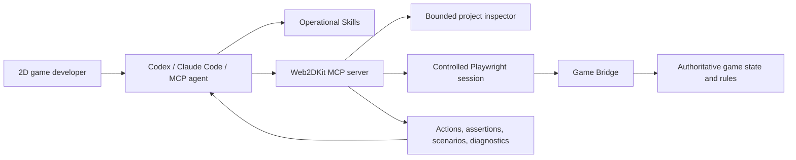

# Architecture

Web2DKit is a local, host-neutral game-development capability layer. The coding agent remains responsible for reasoning, source edits, terminal commands, Git, and generic visual inspection.

## Boundaries

### Host agent

- understands the user's goal;
- edits source and tests;
- starts the game's development server;
- owns Git and generic browser/screenshot workflows.

### Skills

- define the order of inspection, implementation, playtesting, and debugging;
- require evidence and completion gates;
- prevent visual output from being mistaken for rule correctness.

### MCP server

- exposes only bounded, game-domain operations;
- constrains project inspection to `WEB2DKIT_ROOT`;
- accepts `http://` and `https://` game URLs only;
- returns structured envelopes and self-correctable errors;
- owns process-local browser sessions and releases them explicitly.

### Game Bridge

- adapts a game's authoritative state to a stable JSON contract;
- resets with a seed;
- optionally dispatches semantic actions and steps logical frames;
- remains independent of DOM, Canvas, Phaser, PixiJS, or another renderer.

## Why TypeScript, MCP, and Playwright?

- **TypeScript/Node.js** matches the browser game ecosystem and allows the Bridge types and server to share one language.
- **Official MCP SDK** provides the cross-agent tool contract, schemas, annotations, structured results, and stdio transport.
- **Playwright** supplies deterministic browser isolation and real input events without inventing a second browser automation protocol.
- **Zod/JSON Schema** makes tool arguments machine-checkable before they reach a session.
- **Vitest** runs pure rule tests and real-browser integration tests in one project.

No database is required because v0.1 sessions are intentionally process-local. No Docker layer is required because the server is a local plugin. No LLM SDK or orchestration framework is required because the host agent already supplies the model and reasoning loop.

## Extension points

Framework adapters should implement the same Bridge contract rather than add framework-specific MCP tools. Saved scenario files, performance budgets, and trace artifacts may extend the core without granting arbitrary filesystem or shell access.
