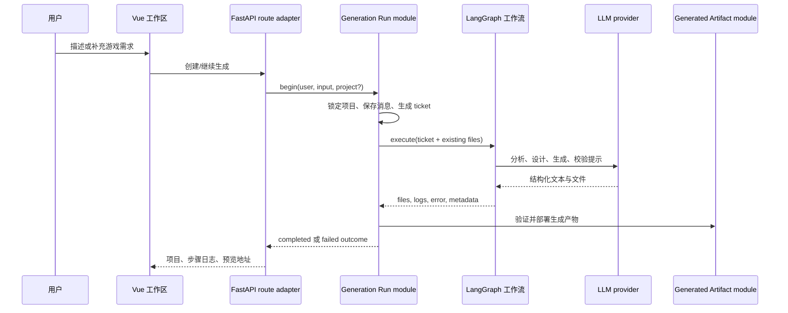

# DreamCoder 架构说明

## 设计目标

DreamCoder 首先是一个可理解、可修改的完整 AI 应用参考实现。技术选型服务于三条用户链路：

1. 用自然语言创建一个可玩的浏览器小游戏；
2. 基于已有文件继续修改，而不是每轮重新生成；
3. 在本地用最少依赖运行，并能按托管需求替换基础设施 adapter。

## 核心链路

## 两个 deep module

### Generation Run module

文件：`backend/modules/generation_run.py`

它的 interface 只有开始和执行一轮生成所需的概念，内部隐藏：

- 新建与继续项目的状态转换；
- 现有文件快照；
- 数据库事务和失败回滚；
- 工作流线程标识；
- 步骤日志、聊天消息和最终状态。

这样 route adapter 不需要复制生命周期逻辑，测试也可以通过 module interface 覆盖真实状态机。

### Generated Artifact module

文件：`backend/modules/generated_artifact.py`

模型输出始终被视为不可信输入。该 module 集中处理：

- 相对路径标准化与路径穿越拒绝；
- 文件数量、单文件大小和总大小限制；
- 必需入口文件；
- 写入临时目录后原子替换目标目录。

部署 adapter 只写入已验证的产物，不重新解释或放宽规则。

## 为什么选择这些技术

| 需求 | 默认选择 | 原因 | 何时替换 |
|---|---|---|---|
| HTTP 与 OpenAPI | FastAPI | Python LLM 生态友好，异步接口和类型清晰 | 团队已有其他后端平台时 |
| 生成工作区 | Vue 3 + Vite | 适合交互式文件树、聊天和 iframe 预览 | 已有 React/Svelte 前端资产时 |
| 多阶段生成 | LangGraph | 显式状态与节点便于观察生成步骤 | 流程足够简单时可改为普通函数管线 |
| 本地持久化 | SQLite | 零服务依赖，适合个人开发和教学 | 多实例、并发写入或集中备份时用 PostgreSQL |
| 本地验证码 | 进程内 TTL store | 无需 Redis 即可完成首次体验 | 多实例或需要跨进程共享时用 Redis |
| 浏览器产物 | HTML/CSS/JS | 无编译、可直接预览、反馈可视 | 目标变为引擎游戏或原生应用时 |

Docker、PostgreSQL、Redis 和 ChromaDB 都是可选 adapter。只有出现多实例一致性、运维交付、向量检索经过评测等明确需求时才应进入默认路径。

## 数据与状态

- `GameProject` 保存项目元数据、当前文件和生成状态。
- `ChatMessage` 保存用户需求、步骤说明和最终结果。
- `GenerationStep` 保存可追踪的工作流步骤。
- `GenerationRunTicket` 是 `begin` 后的不可变运行快照，避免执行阶段重新读取易变输入。

当前使用 SQLAlchemy `create_all` 完成本地建表，尚未引入正式迁移框架。公开且长期运行的实例应在 schema 演进前加入 Alembic。

## 已知架构债务

- provider 创建、结构化解析、重试和超时仍分散在工作流中，下一步应形成一个更深的 provider module。
- SSE interface 目前在流程完成后返回步骤日志，不是节点级实时进度。
- 生成预览仍与主应用同源，应迁移到独立 origin 或隔离容器。
- 配置读取分散在多个模块，托管场景需要更强的启动时校验。

这些债务按 [Roadmap](../ROADMAP.md) 处理，不通过提前加入更多基础设施来掩盖。
