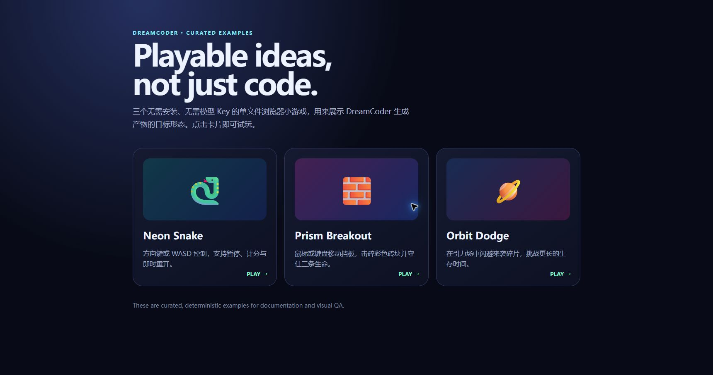
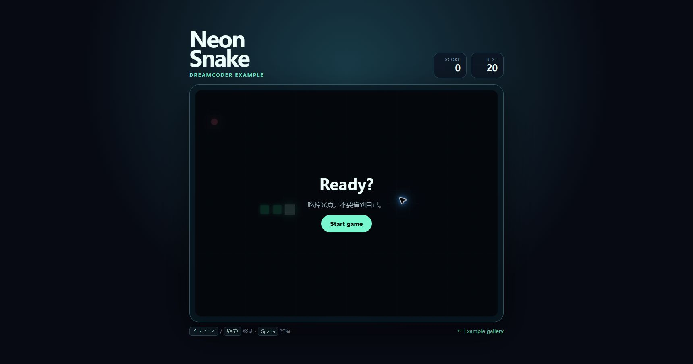
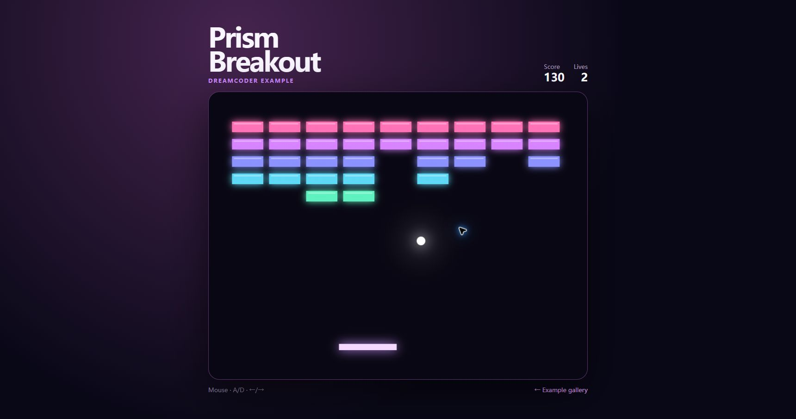
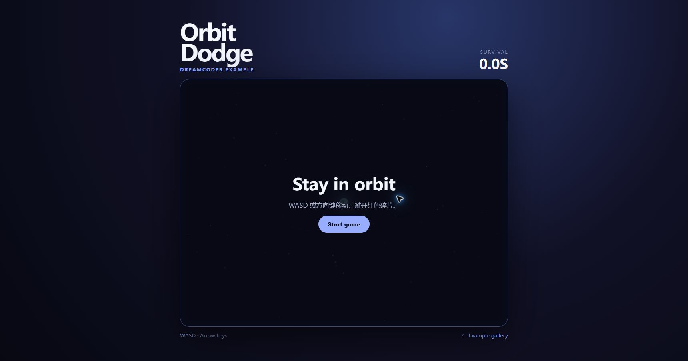

# CSDN 首发草稿

> 状态：待维护者确认截图、真实模型演示与最终 GitHub 链接后发布。本文不应在确认前自动发布。

## 发布元数据

- **推荐标题**：FastAPI + Vue 3 + LangGraph 实战：可接 DeepSeek 的 AI 网页游戏生成器（开源）
- **备选标题 A**：不再做聊天机器人：我用 LangGraph 做了一个能继续修改的 AI 游戏生成器
- **备选标题 B**：AI 生成的 HTML 游戏怎么安全预览？一个 FastAPI + Vue 3 开源项目实战
- **摘要**：DreamCoder 是一个开源、自托管的 AI Web 小游戏生成工作台。本文从可运行示例出发，拆解自然语言需求、LangGraph 多节点生成、已有文件续写、安全预览和本地优先部署，并给出可复制的启动步骤。
- **建议标签**：`LangGraph` `FastAPI` `Vue3` `DeepSeek` `AI应用开发` `开源项目` `HTML5游戏`
- **专栏建议**：AI 应用工程实战
- **首图**：`docs/assets/examples-gallery.png`

---

# FastAPI + Vue 3 + LangGraph 实战：可接 DeepSeek 的 AI 网页游戏生成器（开源）

很多 AI 项目教程最后只得到一个聊天框：用户输入一句话，模型返回一段代码，然后流程结束。

我想验证一个更完整的问题：**能不能让用户用自然语言创建一个真正可玩的网页小游戏，看到生成文件，在浏览器里预览，再基于原有代码继续修改？**

于是有了开源项目 DreamCoder。它不是成熟 SaaS，也不是通用 AI IDE，而是一个可以运行、阅读和改造的 AI 应用工程参考实现。



上图的 Neon Snake、Prism Breakout 和 Orbit Dodge 是仓库内置的离线确定性示例，用于展示目标产物与视觉验收，不代表某个模型每次都能生成相同质量。

项目地址：<https://github.com/44-99/DreamCoder>

## 先说结论：本地运行不需要 Docker、PostgreSQL 或 Redis

DreamCoder 的核心用户是学习或研究完整 AI 应用的开发者。对这类用户，第一目标应该是尽快跑通：

```text
描述需求 → 生成文件 → 安全校验 → 浏览器预览 → 基于现有文件继续修改
```

因此本地默认只需要：

- Python 3.11+
- Node.js 20.19+ 或 22.12+
- SQLite（Python 直接使用）
- DeepSeek、OpenAI 或 Qwen 的一个 API Key

PostgreSQL 解决多实例与集中备份，Redis 解决跨进程验证码状态，Docker Compose 解决一致的托管环境。没有这些需求时，它们不应该成为首次体验的门槛。

## 十分钟 Quickstart

克隆项目并复制环境文件：

```bash
git clone https://github.com/44-99/DreamCoder.git
cd DreamCoder
cp backend/.env.example backend/.env
```

Windows PowerShell 使用：

```powershell
Copy-Item backend/.env.example backend/.env
```

编辑 `backend/.env`。以 DeepSeek 为例：

```env
LLM_PROVIDER=deepseek
DEEPSEEK_API_KEY=your-key
```

模型 ID 会变化。如果 provider 提示 model not found，应以官方模型目录为准，覆盖 `DEEPSEEK_MODEL`、`OPENAI_MODEL` 或 `QWEN_MODEL`，不要盲目复制旧文章里的 ID。

启动后端：

```bash
cd backend
python -m venv .venv
source .venv/bin/activate
pip install -r requirements.txt
uvicorn main:app --reload
```

Windows PowerShell 的激活命令是：

```powershell
.\.venv\Scripts\Activate.ps1
```

打开第二个终端启动前端：

```bash
cd frontend
npm install
npm run dev
```

访问 <http://localhost:5173>。开发模式会生成并自动填入本机一次性验证码，因此不需要先配置 SMTP 或短信。

第一次可以输入：

> 生成一个复古像素风贪吃蛇游戏，支持方向键控制、计分、暂停和重新开始。

生成完成后继续输入：

> 保留原有玩法，增加最高分记录和速度逐渐提升的机制。

第二次请求会携带已有项目文件，这一点很重要。

## 整体架构：route adapter 不拥有生成生命周期

核心链路如下：

```text
Vue 工作区
  ↓
FastAPI route adapter
  ↓
Generation Run module
  ↓
LangGraph: 需求分析 → 架构设计 → 代码生成 → 检查 → 部署
  ↓
Generated Artifact module
  ↓
源码查看 + iframe 预览
```

LangGraph 中的节点是显式连接的：

```python
workflow.add_node("requirement_analyzer", requirement_analyzer_node)
workflow.add_node("architect_designer", architect_designer_node)
workflow.add_node("code_generator", code_generator_node)
workflow.add_node("test_validator", test_validator_node)
workflow.add_node("deployment", deployment_node)

workflow.add_edge("requirement_analyzer", "architect_designer")
workflow.add_edge("architect_designer", "code_generator")
workflow.add_edge("code_generator", "test_validator")
workflow.add_edge("test_validator", "deployment")
```

但图只是工作流的一部分。真正容易出错的是“每次运行前后谁负责项目状态、数据库事务和失败收尾”。

为此项目把完整生命周期放进 `GenerationRunModule`，route adapter 只负责把 HTTP 输入转换为 module interface 调用。

## 工程问题一：继续生成不能丢掉原有代码

很多演示项目的“继续修改”实际上只是把上一轮对话文本拼进 prompt。对代码项目而言，这不够可靠。

DreamCoder 在开始下一轮 Generation Run 时，先复制当前项目文件：

```python
existing_files = deepcopy(project.files or {})
project.status = "generating"
```

然后把不可变快照放进运行票据：

```python
GenerationRunTicket(
    project_id=project.id,
    user_input=user_input,
    existing_files=existing_files,
    thread_id=f"project_{project.id}_{uuid4().hex}",
)
```

工作流收到 `existing_files` 后，才能基于真实文件做增量修改。这样测试也能直接验证“第二轮是否拿到了上一轮产物”。

## 工程问题二：失败也必须结束生命周期

如果创建项目后模型超时、解析失败或部署报错，但数据库状态仍停在 `generating`，用户就无法继续操作。

Generation Run module 统一处理成功和失败：

- 开始时原子保存项目状态与用户消息；
- 执行时使用独立 ticket；
- 成功时写入文件、步骤与完成消息；
- 异常时把项目改为 `failed` 并保存错误消息；
- 数据库异常时回滚事务。

这类代码没有漂亮的 AI 截图，却决定了项目是否真的能长期运行。

## 工程问题三：模型生成的文件不是可信代码

模型可能返回以下危险路径：

```text
../../.env
C:\Users\name\secret.txt
.hidden/config
```

也可能返回大量文件或超大文本。DreamCoder 的 Generated Artifact module 在写盘前统一检查：

- 必须包含根目录 `index.html`；
- 不允许绝对路径、`..`、隐藏路径和系统保留文件名；
- 限制文件数量、单文件大小与总大小；
- 先写临时目录，再原子替换最终目录。

关键原则是：**部署 adapter 只能写入已经验证的产物，不能自己重新解释路径规则。**

## 浏览器预览为什么还要 CSP 和 iframe sandbox？

路径安全只解决服务器文件系统问题。生成的 JavaScript 仍可能发起网络请求、提交表单或尝试导航页面。

前端给预览 HTML 注入 CSP：

```javascript
const PREVIEW_CSP = [
  "default-src 'none'",
  "script-src 'unsafe-inline'",
  "style-src 'unsafe-inline'",
  "img-src data: blob:",
  "connect-src 'none'",
  "form-action 'none'",
  "base-uri 'none'"
].join('; ')
```

同时 iframe 只保留：

```html
<iframe sandbox="allow-scripts">
```

这仍然不是完整的多租户安全沙箱。当前预览与主应用同站点，公开运行匿名用户代码前，应该迁移到独立 origin 或一次性隔离容器，并进行独立安全评审。

## 为什么选择 FastAPI、Vue 3 和 LangGraph？

不是因为技术越多越好，而是分别对应具体需求：

| 用户问题 | 选择 | 原因 |
|---|---|---|
| Python 模型生态与异步接口 | FastAPI | OpenAPI、依赖注入和异步任务容易组合 |
| 文件树、聊天、预览工作区 | Vue 3 + Vite | 交互式单页应用开发成本较低 |
| 多阶段、有状态的生成过程 | LangGraph | 节点、状态和检查点比隐式调用链更容易观察 |
| 零服务本地存储 | SQLite | 克隆后不需要先安装数据库服务 |

如果未来工作流只有一两步，普通 Python 函数管线可能比 LangGraph 更合适；如果团队已有 React 前端，也没有必要为了项目名强制换 Vue。

## 不用 API Key 也能先看目标产物

仓库提供三个单文件离线示例：

```bash
python -m http.server 4173
```

访问 <http://localhost:4173/examples/> 即可试玩。这些样例也是 UI 回归与文档截图的稳定基线。







## 当前限制

为了避免把实验项目包装成成熟产品，下面几项必须说明：

1. 当前主要面向 HTML/CSS/JavaScript 浏览器小游戏；
2. 代码检查仍是启发式规则，不是完整浏览器自动化测试；
3. SSE 返回步骤日志，但还不是 token 或节点级实时流；
4. 同源预览不适合直接用于匿名多租户环境；
5. 不同 provider 和模型版本的生成质量尚未形成公开评测集。

## 你可以从哪些方向参与？

- 提交一个可复现的生成失败案例；
- 增加新的单文件浏览器小游戏示例；
- 改进 provider 兼容、错误提示或跨平台 Quickstart；
- 增加恶意生成产物的回归测试；
- 验证 Windows、macOS 和 Linux 的首次运行时间。

GitHub：<https://github.com/44-99/DreamCoder>

如果这个项目对你研究完整 AI 应用有帮助，可以 Star、提交 Issue，或者告诉我你最想看的下一篇：

- LangGraph 多节点代码生成工作流拆解；
- AI 生成 HTML 的安全预览；
- 为什么默认 SQLite，而不是强制 Docker + PostgreSQL + Redis；
- DeepSeek、OpenAI、Qwen 的 provider 兼容层与结构化输出差异。

---

## 发布前检查（不进入正文）

- [ ] 用维护者账号完成一次真实“创建 + 继续修改”并录制 GIF/视频
- [ ] 确认截图与当前 UI 一致
- [ ] GitHub main 已包含本文引用的代码与文档
- [ ] GitHub Actions CI 为绿色
- [ ] 创建 `v0.1.0` Release 后，把版本链接补进正文
- [ ] CSDN 图片重新上传到平台，检查三张游戏图没有失真
- [ ] 文末链接带可识别来源参数，或至少在 GitHub Traffic 记录发布日期
- [ ] 发布后 24 小时内回复评论与 Issue
